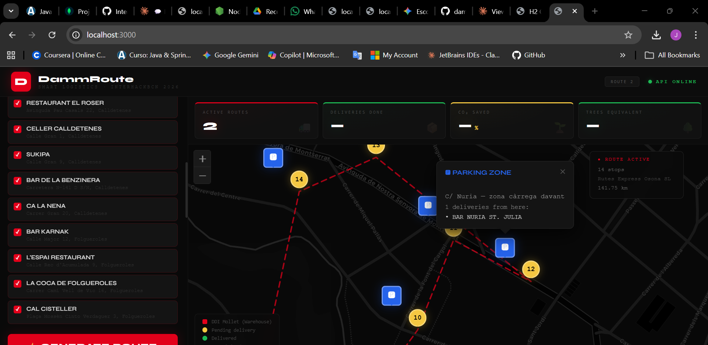
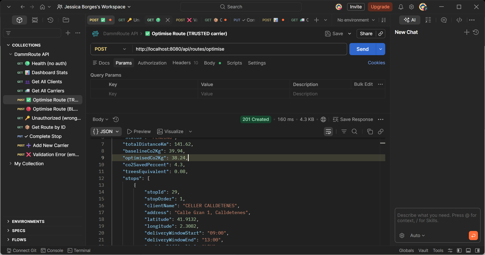
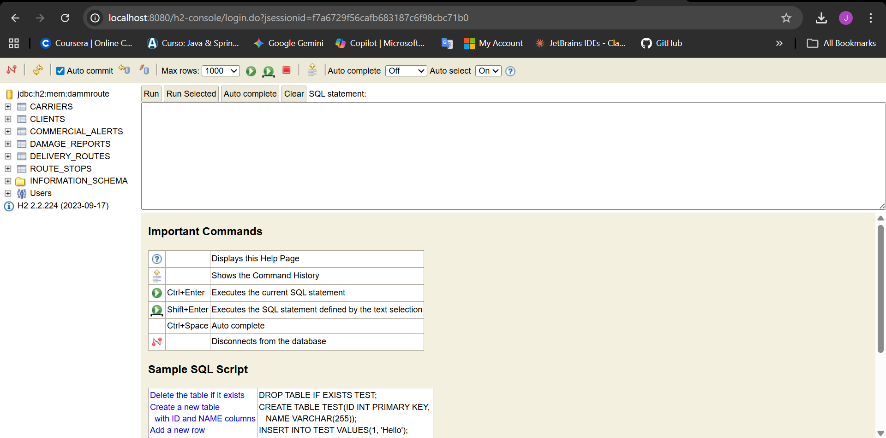

# 🚛 DammRoute — Smart Logistics Platform

> **InterhackBCN 2026 · Damm Challenge**
> Parking-first route optimization for beer distribution in Catalonia



---

## 🎯 The Problem

Damm's distribution trucks waste time circling for parking in narrow Catalan streets. Drivers don't know where to park, which deliveries to group, or how to minimize CO₂ emissions across their route.

## 💡 Our Solution

**DammRoute** optimizes delivery routes by **parking zones first** — not individual clients. The algorithm:

1. **Groups clients by nearest loading bay** — clients sharing a parking zone are clustered together
2. **Routes between parking nodes** using greedy nearest-neighbor with time window awareness
3. **The driver parks once per zone** and delivers to all clients on foot
4. **Tracks CO₂ savings** comparing optimized vs. naive routing

---

## 🏗️ Architecture

```
┌─────────────────────────────────────────────────────┐
│                    FRONTEND                          │
│         React · Leaflet · Dark Theme                 │
│   Map + Parking Markers + Delivery Tracking          │
├─────────────────────────────────────────────────────┤
│                   REST API                           │
│              Spring Boot 3.3.5                       │
│     /api/clients · /api/carriers · /api/routes       │
├─────────────────────────────────────────────────────┤
│               SERVICES                               │
│  RouteOptimizerService (parking-first algorithm)     │
│  FraudSentinel (carrier trust scoring)               │
│  Co2CalculatorService (haversine + emissions)        │
│  WarehouseService (loading sheets + damage reports)  │
├─────────────────────────────────────────────────────┤
│              H2 IN-MEMORY DB                         │
│  Clients · Carriers · Routes · Stops · Alerts        │
└─────────────────────────────────────────────────────┘
```

---

## 🔑 Key Features

### 🅿️ Parking-First Route Optimization
Clients are grouped by their nearest loading bay. The truck navigates between parking zones, not individual addresses. The driver walks to deliver within each zone.

### 🛡️ FraudSentinel — Carrier Trust Scoring
Each carrier has a trust score computed from document verification, identity flags, and dispute history. Carriers below threshold 50 are **automatically blocked** from new routes (HTTP 403).

### 🌱 CO₂ Calculator
Every route compares optimized distance vs. naive routing and calculates CO₂ savings in kg, percentage, and tree equivalents.

### 📦 Warehouse Operations
Loading sheets, delivery confirmation, damage reports, and incident alerts — all tracked per stop.

### 🗺️ Live Dashboard
Dark-themed React dashboard with Leaflet map showing:
- 🔴 Warehouse (DDI Mollet del Vallès)
- 🟡 Pending delivery stops
- 🟢 Delivered stops
- 🔵 Parking zone markers with client lists
- 🔴 Optimized route line

---

## 📸 Screenshots

### Route Map with Parking Zones


### API Response — Postman


### H2 Database Schema


---

## 🛠️ Tech Stack

| Layer      | Technology                                      |
|------------|------------------------------------------------|
| Backend    | Java 21 · Spring Boot 3.3.5 · Spring Security |
| Database   | H2 (in-memory) · JPA / Hibernate              |
| Frontend   | React · Leaflet · CARTO dark tiles            |
| API        | REST · JSON · API Key authentication           |
| Build      | Maven · npm                                    |

---

## 🚀 Quick Start

### Backend
```bash
cd dammroute
./mvnw spring-boot:run
# or in IntelliJ: Run DammRouteApplication.java
```

### Frontend
```bash
cd frontend
npm install
npm start
```

- **Backend:** http://localhost:8080
- **Frontend:** http://localhost:3000
- **H2 Console:** http://localhost:8080/h2-console (JDBC URL: `jdbc:h2:mem:dammroute`, user: `sa`)

---

## 📡 API Endpoints

| Method | Endpoint                                  | Description                    |
|--------|------------------------------------------|--------------------------------|
| GET    | `/api/health`                            | Health check                   |
| GET    | `/api/clients`                           | List all delivery points       |
| GET    | `/api/carriers`                          | List all carriers              |
| POST   | `/api/routes/optimise`                   | Generate optimized route       |
| GET    | `/api/routes/{id}`                       | Get route details              |
| GET    | `/api/routes/{id}/loading-plan`          | Truck loading sheet            |
| GET    | `/api/routes/{id}/warehouse-sheet`       | Warehouse pick list            |
| POST   | `/api/routes/{id}/stops/{stopId}/confirm-delivery` | Confirm delivery   |
| POST   | `/api/routes/{id}/stops/{stopId}/damage` | Report damage                  |
| GET    | `/api/dashboard/stats`                   | Dashboard statistics           |

---

## 🧠 Algorithm: Parking-First Optimization

```
1. INPUT: List of clients with coordinates + orders + nearestLoadingBay

2. CLUSTER: Group clients by shared parking zone (nearestLoadingBay)
   Example: 5 clients on C/ Gran → 1 parking cluster

3. GROUP PARKING ZONES: Grops parking zones in groups of 1 truck

4. ORDER CLUSTERS: Each of these grupos gets a optimazed route, taking in acaount distance, schedules, truck distribution and warehouse optimization.
Starting from DDI Mollet warehouse → nearest cluster → next → ...

5. OUTPUT: Ordered list of stops, grouped by parking zone and optimazed with truck besides best truck distribution.
   Driver parks once per zone, delivers on foot
```

**Fallback:** If the Python graph optimizer is available, it runs first. If unavailable, the parking-first greedy algorithm activates automatically.

---

## 👥 Team

| Name | Role |
|------|------|
| **Jess Borges** | Backend Development · Route Optimizer · FraudSentinel · Architecture |
| **[Name 1]** | [Role — e.g., Algorithm Design / Data Analysis] |
| **[Name 2]** | [Role — e.g., Frontend / UX / Research] |

---

## 📊 Impact Numbers

- **Parking events reduced:** ~60% fewer stops (cluster vs. individual)
- **CO₂ savings:** ~4-35% per route vs. naive routing
- **Route distance:** 141.75 km optimized for 14 delivery points
- **Fraud prevention:** Automated carrier blocking via trust scoring

---

## 📄 License

Built for InterhackBCN 2026 — Damm Challenge.
